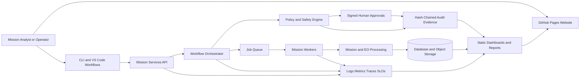

# OpenSat Mission Lab

**An open-source, home-PC-compatible digital mission engineering laboratory for spacecraft analysis, Earth observation, secure mission operations, distributed infrastructure, and safety-governed workflow orchestration.**

> **Current release:** v3.1  
> **Website:** GitHub Pages-ready static site in [`site/`](https://samuelson777.github.io/OpenSat-Mission-Lab/)  
> **Primary workspace:** [`OpenSat-Mission-Lab.code-workspace`](https://samuelson777.github.io/OpenSat-Mission-Lab-Versions/)

---

## Overview

OpenSat Mission Lab is a modular engineering project that demonstrates how the major parts of a modern space mission can be explored in one reproducible, open-source environment.

The project combines:

- mission analysis and orbital engineering;
- spacecraft, payload, power, thermal, and communication modelling;
- Earth-observation data processing;
- APIs, workers, databases, object storage, and distributed services;
- cybersecurity, identity, authorization, audit, and supply-chain controls;
- observability, autoscaling, resilience, and multi-region operations;
- human-in-the-loop mission workflows;
- cryptographically signed approvals and time-bounded command authorization;
- static HTML dashboards and a GitHub Pages portfolio website.

The platform is designed to run on a normal personal computer. It is intended for learning, experimentation, technical portfolios, architecture demonstrations, and open-source collaboration.

OpenSat Mission Lab is **not flight-certified software**, a real spacecraft command system, or a substitute for licensed ground-station infrastructure.

---

## Project Goals

OpenSat Mission Lab was created to:

1. demonstrate broad space-systems and software-engineering skills in one coherent project;
2. connect scientific analysis with realistic mission-operations workflows;
3. produce visible, auditable evidence rather than isolated scripts;
4. remain reproducible and practical on a home computer;
5. provide a modular foundation for future research and community contributions;
6. clearly separate simulation from operational spacecraft authority.

---

## Key Capabilities

### Mission and Spacecraft Engineering

- Mission definition and scenario configuration
- Orbit and access-analysis workflows
- Spacecraft subsystem modelling
- Power, thermal, communication, and payload analysis
- Time-series mission simulations
- Ground-contact and operations planning
- Deterministic engineering outputs and plots

### Earth Observation and Geospatial Processing

- Raster and time-series processing
- Observation-product generation
- Flood-response demonstration workflows
- Quality checks and metadata generation
- Visual evidence and downloadable outputs
- Extensible architecture for atmospheric correction, segmentation, and change detection

### Mission Services and Data Platform

- Command-line tools and Python package interfaces
- FastAPI-compatible service layer
- Background workers and job processing
- Repository and persistence abstractions
- Object-storage workflows
- OpenAPI evidence
- Multi-tenant service patterns

### Security and Zero Trust

- Tenant-aware authorization
- Service and workload identities
- Ed25519-signed tokens and approvals
- External policy-decision integration
- Fail-closed policy behaviour
- Key rotation and revocation patterns
- KMS-style envelope encryption
- Security attack-regression tests
- Hash-chained audit evidence

### Software Supply-Chain Security

- CycloneDX software bill of materials
- Source manifests and SHA-256 hashing
- Deterministic source archives
- Reproducible-build comparison
- In-toto/SLSA-shaped provenance
- Detached release signatures
- Dependency-policy enforcement
- Offline advisory matching
- Secret scanning
- GitHub Actions validation workflows

### Observability and Resilience

- Structured logs
- Metrics and Prometheus-compatible exports
- Distributed traces
- SLO and error-budget evaluation
- Incident records and response timelines
- Chaos experiments
- Automated rollback
- Worker recovery and queue reprocessing
- Capacity and health dashboards

### Distributed and Multi-Region Operations

- Three-region active-active simulation
- Health- and latency-aware traffic steering
- Cross-region job-state replication
- Regional failover and recovery
- Cost- and carbon-aware workload placement
- Strong, bounded-staleness, and eventual-consistency policies
- Conflict resolution and quarantine
- Global and per-tenant rate limiting
- India and EU data-sovereignty routing
- Audited failover decisions

### Policy-Governed Mission Orchestration

- Dependency-validated workflow DAGs
- Human approval and rejection gates
- Idempotent workflow and task execution
- Bounded retries
- Durable pause and resume
- Compensation actions
- Replayable event histories
- Terminal-state reconstruction
- Safe command-transmission authorization

### v3.1 Safety Assurance

- Ed25519-signed approval records
- Requester/approver separation of duties
- Two-person approval bundles
- Time-limited command grants
- Exact workflow and command-digest binding
- Safety-blackout and power-state inhibition
- Workflow-version migration
- Exhaustive finite-state safety checking
- Approval, authorization, and migration evidence

---

## Latest Validation Results

The v3.1 release produced the following deterministic engineering results:

| Validation area | Result |
|---|---:|
| Automated repository tests | **203 passed** |
| v3.1 safety controls | **28/28 passed** |
| Verified approval signatures | **10** |
| Validated dual-signature bundles | **5** |
| Invalid approval attempts blocked | **3** |
| Time-bounded command grants | **2** |
| Valid command attempts allowed | **2** |
| Unsafe command attempts blocked | **5** |
| Workflow snapshots migrated | **3** |
| Command-gate model states evaluated | **256** |
| Safety invariants | **8 passed** |
| Invariant violations | **0** |
| Final simulated platform state | **HEALTHY** |

These results apply to the deterministic project validation environment. They do not constitute independent certification of flight software, operational security, legal compliance, or spacecraft-command authority.

---

## Architecture



---

## Repository Structure

```text
opensat-mission-lab/
├── .github/
│   └── workflows/              # CI, validation, security, and Pages deployment
├── .vscode/                    # VS Code launch and task profiles
├── config/                     # Mission, policy, security, and operations settings
├── deploy/                     # Docker, Kubernetes, PostgreSQL, OPA, and telemetry assets
├── docs/                       # Additional technical documentation
├── examples/                   # Reproducible mission scenarios
├── outputs/                    # Generated evidence and dashboards
├── policies/                   # Authorization and governance policies
├── runbooks/                   # Operator recovery procedures
├── scripts/                    # Setup, validation, and local-serving scripts
├── site/                       # Static GitHub Pages website
├── src/
│   └── opensatlab/             # Main Python package
├── tests/                      # Automated test suite
├── OpenSat-Mission-Lab.code-workspace
├── ORCHESTRATION_SAFETY_ASSURANCE_GUIDE.md
├── README.md
└── pyproject.toml
```

Some folders may contain release-specific subdirectories and generated artifacts.

---

## Requirements

Recommended local environment:

- Python 3.11 or newer
- Python 3.13 supported by the validated development environment
- Git
- Visual Studio Code
- PowerShell on Windows
- A modern web browser

Optional components:

- Docker Desktop
- PostgreSQL
- Open Policy Agent
- Prometheus
- OpenTelemetry Collector
- Kubernetes tooling

The core deterministic demonstrations do not require cloud infrastructure.

---

## Quick Start

### 1. Clone the repository

```bash
git clone https://github.com/YOUR-USERNAME/YOUR-REPOSITORY.git
cd YOUR-REPOSITORY
```

Replace `YOUR-USERNAME` and `YOUR-REPOSITORY` with the actual GitHub values.

### 2. Create a virtual environment

#### Windows PowerShell

```powershell
py -m venv .venv
.venv\Scripts\Activate.ps1
python -m pip install --upgrade pip
python -m pip install -e .
```

The included setup script can also be used:

```powershell
Set-ExecutionPolicy -Scope Process Bypass
.\scripts\setup_windows.ps1
```

#### Linux or macOS

```bash
python3 -m venv .venv
source .venv/bin/activate
python -m pip install --upgrade pip
python -m pip install -e .
```

### 3. Run the automated tests

```bash
python -m pytest -q
```

### 4. Run the v3.1 safety-assurance scenario

```bash
opensat-v31-demo --output outputs/v3.1
```

Equivalent command:

```bash
opensatlab v31-demo --output outputs/v3.1
```

### 5. Open the generated dashboard

Serve the output directory:

```bash
python -m http.server 8785 --directory outputs/v3.1
```

Open:

```text
http://127.0.0.1:8785/v31_safety_assurance_dashboard.html
```

---

## Run with Visual Studio Code

1. Open `OpenSat-Mission-Lab.code-workspace`.
2. Select the `.venv` Python interpreter.
3. Open **Run and Debug**.
4. Choose:

```text
OpenSat: Run v3.1 safety-assured orchestration
```

5. Press `F5`.

To serve the dashboard, select:

```text
OpenSat: Serve v3.1 safety-assurance dashboard
```

---

## GitHub Pages Website

The static project website is stored in:

```text
site/
```

It includes:

- project overview pages;
- capability and evidence sections;
- release dashboards;
- generated plots;
- deployment guidance;
- downloadable validation artifacts;
- responsive navigation;
- custom error handling;
- repository-link detection.

### Preview locally

```bash
python -m http.server 8000 --directory site
```

Open:

```text
http://127.0.0.1:8000/
```

### Deploy with GitHub Actions

1. Push the repository to GitHub.
2. Open **Settings → Pages**.
3. Under **Build and deployment**, select **GitHub Actions**.
4. Push to the configured default branch.

The Pages workflow publishes the contents of `site/`.

The public URL normally follows:

```text
https://YOUR-USERNAME.github.io/YOUR-REPOSITORY/
```

---

## Principal Commands

| Command | Purpose |
|---|---|
| `opensatlab --help` | Show the main CLI |
| `opensat-v31-demo` | Run v3.1 safety validation |
| `opensatlab v31-demo` | Run v3.1 through the main CLI |
| `python -m pytest -q` | Run all automated tests |
| `python -m http.server 8000 --directory site` | Preview the website |
| `python -m http.server 8785 --directory outputs/v3.1` | Serve v3.1 evidence |

Earlier release demonstrations remain available through their corresponding CLI commands and output directories.

---

## Generated v3.1 Evidence

```text
outputs/v3.1/
├── approval_bundle_validation.csv
├── approval_signature_verification.png
├── authorization_windows.png
├── command_authorization_grants.csv
├── command_gate_decisions.csv
├── migrated_workflow_snapshots.json
├── prometheus_v31_metrics.txt
├── safety_invariant_model_check.png
├── safety_invariant_results.csv
├── safety_state_space.csv
├── separation_of_duties.png
├── separation_of_duties_attempts.csv
├── signed_approval_records.csv
├── signer_identities.csv
├── v31_safety_assurance_dashboard.html
├── v31_summary.json
├── v31_summary.txt
├── v31_validation.csv
├── workflow_definition_v31.json
├── workflow_migrations.csv
└── workflow_version_migration.png
```

---

## Testing and Reproducibility

The project emphasizes evidence-driven engineering.

A feature is considered complete only when it is accompanied by one or more of the following:

- automated tests;
- deterministic scenario inputs;
- machine-readable evidence;
- visual plots;
- dashboard output;
- policy or configuration files;
- operational runbooks;
- validation summaries;
- checksums and signed artifacts.

To reproduce the latest release:

```bash
python -m pytest -q
opensat-v31-demo --output outputs/v3.1
```

Review:

```text
outputs/v3.1/v31_summary.txt
outputs/v3.1/v31_validation.csv
outputs/v3.1/v31_safety_assurance_dashboard.html
```

---

## Security and Safety Boundaries

OpenSat Mission Lab contains security and mission-safety demonstrations, but the following boundaries are essential:

- It does not communicate with or control an operational spacecraft.
- It does not authorize transmission on regulated radio frequencies.
- Demonstration signing identities are not operational credentials.
- Simulated approval records do not establish legal authority.
- The finite-state invariant model is educational and bounded.
- Multi-region metrics are deterministic inputs, not cloud-provider guarantees.
- Data-sovereignty policies are engineering examples, not legal certification.
- Security regression tests are not a substitute for independent penetration testing.
- The project is not flight-qualified, safety-certified, or mission-certified.

Any operational adaptation requires independent systems engineering, threat modelling, legal review, radio licensing, verification, validation, and organizational authorization.

---

## Documentation

Important guides include:

- `ORCHESTRATION_SAFETY_ASSURANCE_GUIDE.md`
- `ORCHESTRATION_OPERATIONS_GUIDE.md`
- `MULTIREGION_GOVERNANCE_GUIDE.md`
- `MULTIREGION_OPERATIONS_GUIDE.md`
- `TELEMETRY_AUTOSCALING_GUIDE.md`
- `OBSERVABILITY_RESILIENCE_GUIDE.md`
- `SOFTWARE_SUPPLY_CHAIN_GUIDE.md`
- `ZERO_TRUST_SECURITY_GUIDE.md`
- `SECURITY_PLATFORM_GUIDE.md`

Release notes and historical validation outputs document the project’s evolution.

---

## Future Enhancements

### Higher-Fidelity Mission Physics

- Numerical orbit propagation
- Atmospheric drag and solar-radiation pressure
- Eclipse and visibility prediction
- High-fidelity attitude dynamics
- Reaction-wheel and actuator models
- Sensor uncertainty and state estimation
- Power and thermal coupling

### Hardware-in-the-Loop Integration

- Microcontroller and CubeSat-board interfaces
- Software-defined radio reception
- Sensor and actuator emulation
- Hardware abstraction for simulated and physical devices
- Digital-twin state synchronization

### Ground-Station and Communications Engineering

- Link-budget analysis
- Pass scheduling
- Doppler compensation
- Packet framing and telemetry decoding
- CCSDS-inspired data structures
- Safe integration with public receiving networks

Transmission functionality should remain disabled by default and require explicit legal and operational authorization.

### Advanced Earth-Observation Processing

- Atmospheric correction
- Cloud masking
- Image registration and mosaicking
- Change detection
- Semantic segmentation
- Multi-sensor fusion
- Uncertainty maps
- Disaster-response decision products

### Governed Machine Learning

- Telemetry anomaly detection
- Predictive maintenance
- Mission scheduling
- Image classification and segmentation
- Capacity forecasting
- Model cards, provenance, drift detection, and rollback
- Human review for safety-sensitive outputs

### Production-Grade Distributed Infrastructure

- Durable event streaming
- Real replicated databases
- Distributed object storage
- Infrastructure as code
- Service-mesh security
- Provider-independent failover testing
- Measured RTO and RPO experiments

### Stronger Formal Verification

- Temporal-logic specifications
- Model checking
- Property-based state-machine testing
- Workflow safety proofs
- Command authorization properties
- Data-residency invariants
- Replay and compensation correctness

### Operational Identity and Key Management

- Hardware-backed signing
- Managed KMS and HSM integration
- Certificate authorities
- Short-lived workload identities
- Automated revocation
- External timestamping
- Transparency logs

### Mission-Control Web Application

- Live spacecraft state displays
- Orbit visualizations
- Ground-pass timelines
- Alert and incident management
- Approval queues
- Command-review interfaces
- Audit exploration
- Accessible operator views

### Collaborative Operations

- Authenticated multi-user roles
- Shift handovers
- Incident collaboration
- Approval comments
- Task assignments
- Change proposals
- Immutable operator records

### Standards-Aligned Interfaces

- CCSDS-inspired telemetry and command schemas
- STAC-compatible Earth-observation catalogs
- OpenTelemetry
- OpenAPI
- CycloneDX
- In-toto attestations
- Standard geospatial formats

Standards alignment must not be described as certification unless independently verified.

### Performance Benchmarking

- API throughput
- Workflow latency
- Queue and worker performance
- Storage growth
- Trace volume
- Simulation speed
- Earth-observation processing time
- Hardware-profile comparisons

### Additional Mission Scenarios

- Earth-observation CubeSats
- Weather missions
- Astronomy missions
- Lunar orbiters
- Deep-space precursor missions
- Constellations
- Formation flying
- Space-debris monitoring
- Search-and-rescue payloads
- Inter-satellite networks
- Planetary relay systems

### Open-Source Community Growth

- Contribution guidelines
- Issue and pull-request templates
- Architecture decision records
- Public roadmap
- Beginner-friendly issues
- Maintainer governance
- Contributor recognition
- Reproducible scenario registry

---

## Conclusion

OpenSat Mission Lab demonstrates that a technically credible, multidisciplinary space-mission platform can be developed and validated on a home computer using open-source tools.

The project connects mission analysis, spacecraft modelling, Earth-observation processing, distributed services, cybersecurity, observability, multi-region resilience, human workflow orchestration, cryptographic approvals, and safety-invariant checking in one modular environment.

Its principal strength is evidence-driven implementation. Capabilities are supported by tests, scenarios, policies, machine-readable outputs, plots, dashboards, audit records, runbooks, and reproducible commands. This makes the repository useful as a technical portfolio, educational platform, systems-architecture reference, and foundation for future research.

The current implementation remains a simulator and reference architecture. It does not replace certified flight software, licensed ground systems, independent security assessment, or operational mission authority. Its value lies in making complex mission-engineering concepts transparent, testable, extensible, and accessible.

The long-term objective is to evolve OpenSat Mission Lab into an open digital mission environment where users can design missions, simulate spacecraft and ground operations, process payload data, evaluate security and safety controls, conduct failure exercises, and generate auditable engineering evidence from one integrated platform.

---

## Contributing

Contributions are welcome in areas such as:

- astrodynamics;
- spacecraft systems;
- Earth observation;
- geospatial engineering;
- distributed systems;
- cybersecurity;
- formal verification;
- data visualization;
- technical documentation;
- test engineering;
- accessibility.

Recommended contribution process:

1. Fork the repository.
2. Create a focused feature branch.
3. Add or update tests.
4. Run the complete validation suite.
5. Document assumptions and limitations.
6. Submit a pull request with evidence.

Do not include operational credentials, restricted datasets, unauthorized spacecraft commands, or unlicensed transmission functionality.

---

## Responsible Use

Use this repository for education, research, simulation, architecture exploration, and authorized engineering work.

Do not use it to:

- interfere with spacecraft or ground systems;
- transmit without regulatory authorization;
- bypass safety or approval procedures;
- misrepresent simulated results as operational certification;
- process restricted information without authorization.

---

## License

Add an explicit open-source `LICENSE` file before publishing the repository.

Suitable choices include:

- **Apache License 2.0** for a permissive license with an explicit patent grant; or
- **MIT License** for a short and permissive license.

After selecting a license, replace this section with:

```text
Licensed under the [MIT](https://github.com/Samuelson777/OpenSat-Mission-Lab/blob/main/LICENSE).
```

---

## Citation

A `CITATION.cff` file is recommended for research and academic reuse.

Suggested citation:

```text
SAMUELSON G. OpenSat Mission Lab: An Open-Source Digital Mission
Engineering and Safety-Governed Operations Platform. Version 3.1.
```

Update the citation with the repository URL, release date, DOI, and additional contributors when available.

---

## Author

**SAMUELSON G**

Open-source space engineering, mission systems, scientific computing, secure software architecture, and reproducible technical research.

---

## Acknowledgements

OpenSat Mission Lab is built with open-source scientific, geospatial, web, security, testing, and software-engineering tools. The project is intended to support learning and collaboration across the wider space and open-source communities.
